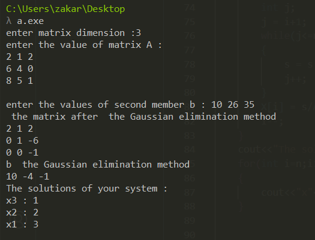
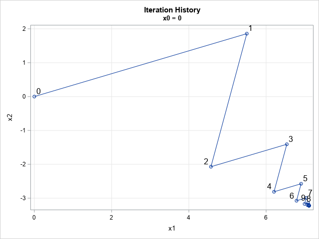
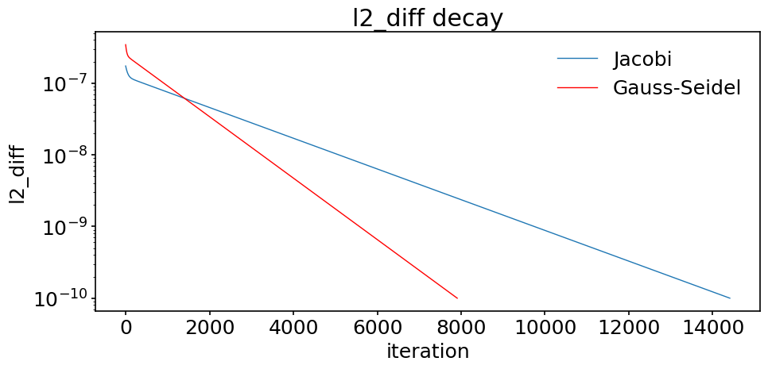

# Solution_of_linear_systems

# Table of Contents

- [Introduction](#introduction)
- [Methods](#methods)
  - [Algorithme d'élimination de Gauss](#algorithme-délimination-de-gauss)
  - [Jacobi's method](#Jacobi's-method)
  - [The Gauss-Seidel Method](#The-Gauss-Seidel-Method)

## Introduction
Linear systems are the building blocks of countless real-world phenomena, from engineering to economics. This project explores the elegant methods used to solve these systems.

## Methods
### 1. Algorithme d'élimination de Gauss
The Gauss method is considered the most popular among the direct methods. The principle of the method is to perform a series of arithmetic operations on the elements of the matrix in order to transform it into an upper triangular matrix, and then use the backtracking method to solve the obtained system. The principle of the Gauss elimination method is then to put the linear system Ax = b in the form Cx = b where the matrix C is upper triangular.

### 2. Jacobi's method 
Jacobi's method is an iterative algorithm used to solve systems of linear equations, particularly for diagonally dominant matrices or symmetric positive definite matrices. It is part of the family of iterative methods, where the solution is gradually improved with each step until a desired level of accuracy is reached.

### 3. The Gauss-Seidel Method
The Gauss-Seidel method is an iterative algorithm for solving systems of linear equations, and it improves on Jacobi's method by using updated values of the solution as soon as they are available during the iteration process. This leads to faster convergence, especially when compared to Jacobi’s method for many systems.

